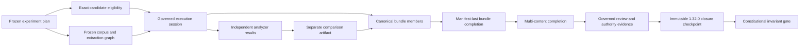

# Constitutional Measurement: A Governed, Evidence-Preserving Workbench for Content Analysis

## Phase 1A architecture and invariant checkpoint

**Joseph J. M. Walker, MBA**  
**Technical report draft — August 5, 2026**

> The workbench does not earn the right to aggregate merely by producing numbers. It must first preserve the evidence, authority, disagreement, and limits behind every measurement.

| Checkpoint item | Exact reference |
| --- | --- |
| Governance closure | corpus `1.32.0` |
| Closure merge | PR #54, `a05d024b1624839d041ba6fe7de921543e6a7fba` |
| Constitutional gate | PR #55 head, `8e5bf354236e3bc7684960a7cc7fdaaaaac63946` |
| Paper base | PR #55 merge, `1f47685d1236d7cbb80468f97fa422db54248779` |
| Canonicalization profile | `ctrt-canonical-json@0.1.0` |
| Validation at the gate head | Ruff passed; strict mypy passed across 107 source files; 678 tests passed in 147.66 seconds |

## Abstract

Content-analysis systems can present a simple output while obscuring construct definitions, input provenance, analyzer identity, disagreement, uncertainty, and lifecycle failure. This report asks whether interchangeable analyzers can be orchestrated so that measurements remain useful, explainable, repeatable, and evidence-grounded before any aggregate score is permitted. It presents Phase 1A of Content Tone & Revenue Transparency (CTRT): a synthetic, provider-neutral workbench governed by a versioned project Constitution. The implementation freezes experiment plans; gates exact candidate, corpus, extraction, credential, revocation, checkpoint, witness, and adjudication references; serializes canonical artifacts; persists them append-only; re-hashes evidence at read time; and distinguishes verified lifecycle completion from analytical success. A nine-test constitutional invariant module composes these mechanisms into a high-signal regression gate. Demonstrated cases preserve opposite analyzer measurements while the comparison abstains, reject artifact replacement and tampering, prevent completion when required evidence is missing, stop unresolved authority before delegation, and verify a closed governance chain while retaining a downstream abstention. The checkpoint is an executable engineering argument, not a formal proof or an evaluation of real models. It makes no claim of accuracy, calibration, validated scoring, production readiness, or consequential decision support.

## 1. Introduction

Digital-content analysis is often experienced through a label, score, ranking, or moderation action. That presentation can hide several prior questions: What construct was measured? Which content span was analyzed? What extraction process produced the input? Which analyzer, version, configuration, and taxonomy generated the output? What happened when instruments disagreed? Which failures were omitted? What evidence authorizes the system to act?

Those questions are not secondary documentation concerns. They determine whether an output remains interpretable at all.

CTRT began from a constitutional constraint: the project measures characteristics of content items, but does not decide what speech should exist or infer the moral worth of a creator or consumer. Measurements must remain traceable to declared dimensions, source evidence, instruments, transformations, uncertainty, disagreement, and known limitations. The [CTRT Constitution](../../CONSTITUTION.md) governs implementation convenience, model performance, commercial pressure, and persuasive presentation.

The initial research question is:

> Can interchangeable analysis models be orchestrated and evaluated in a way that produces useful, explainable, repeatable, and evidence-grounded measurements of real-world content?

Phase 1A narrows that question. It does not yet test real-world analytical accuracy. Instead, it asks whether the research substrate can preserve the conditions required for later evaluation without prematurely selecting instruments or producing an overall score.

The first architectural decision was therefore to build a workbench rather than a scoring product. [ADR-0007](../adr/0007-content-analysis-workbench-first.md) rejects a fixed analyzer stack, category-specific provider interfaces, benchmark-based selection without local evaluation, and provisional aggregation. The workbench registers candidate instruments, executes eligible analyzers against the same canonical target, preserves their independent outputs, compares them side by side, and treats disagreement, failure, partial progress, and abstention as research evidence.

Phase 1A eventually expanded beyond analyzer execution. A measurement cannot be interpreted without its plan, candidate authorization, source and extraction graph, canonical serialization, persistence behavior, lifecycle status, and authority state. The project therefore implemented a complete synthetic path from frozen experiment plans through a closed governance checkpoint. Once that path could express the intended failure modes, [ADR-0057](../adr/0057-close-current-governance-branch-with-immutable-revocation-checkpoint.md) ended automatic governance recursion. [ADR-0058](../adr/0058-make-constitutional-invariants-the-primary-phase-1a-proof-gate.md) then established a small executable gate over the completed machinery.

This paper is the corresponding frozen checkpoint. Its contributions are:

1. a provider-neutral content-analysis workbench that preserves per-analyzer measurements and separate comparison outcomes;
2. exact, versioned authorization for experiments, candidates, corpora, extraction methods, and synthetic authority evidence;
3. canonical, append-only, read-time-verifiable research artifacts and manifest-last completion records;
4. an explicit distinction between structural failure, governed abstention, analytical outcome, and verified lifecycle completion;
5. a closed synthetic governance chain that preserves credentials, revocations, checkpoints, witnesses, conflicts, adjudications, dissent, and inherited outcomes; and
6. a nine-test constitutional regression gate mapped to twelve review headings without replacing the Constitution or duplicating the full diagnostic suite.

The paper deliberately makes narrower claims than the implementation might tempt a reader to infer. Phase 1A has not validated a content score, compared real analyzers, established construct validity, demonstrated production fitness, or authorized consequential use.

## 2. Constitutional requirements and phase discipline

### 2.1 A project Constitution as an operational specification

“Constitutional” in this report refers to the repository’s versioned project Constitution. It is not a legal constitution and it is not the training method commonly called Constitutional AI. The Constitution defines what CTRT may claim, which responsibilities must remain separate, what evidence must be preserved, and when the system must abstain.

The twelve constitutional articles establish the following controlling requirements:

- CTRT measures content characteristics without deciding whether content should exist.
- Extraction, measurement, normalization, aggregation, explanation, evaluation, and stewardship remain separate responsibilities.
- A construct must be operationally defined before it can contribute to a score.
- Canonical measurements preserve content identity, analyzed spans, provenance, analyzer identity, configuration, raw and normalized outputs, timing, warnings, and applicability limits.
- Analyzers are replaceable instruments behind provider-neutral contracts.
- Disagreement and uncertainty remain visible, and the system must be able to abstain.
- Aggregation, when eventually authorized, must be isolated, versioned, reproducible, and no more precise than its evidence.
- Explanations may communicate canonical measurements but may not invent motives or alter scores.
- Claims must be falsifiable, with negative results and regressions preserved.
- Experimental outputs are non-consequential by default.
- material specifications and artifacts are versioned, and reprocessing creates new records rather than rewriting history.
- scope limits cannot be concealed behind implementation progress.

The [Phase 1A constitutional invariant matrix](../phase-1a-constitutional-invariant-matrix.md) organizes these requirements under twelve review headings. The headings are a proof aid, not replacement constitutional language:

1. Measurement ≠ Judgment
2. Verified ≠ Analytically Successful
3. Append-only & Non-replacement
4. Exact-match Gates Only
5. Content & Extraction Provenance Integrity
6. Canonical Serialization & Read-time Rehashing
7. Evidence Graph Completeness
8. Disagreement & Abstention Are First-class
9. Credential / Revocation / Witness Invariants
10. Separation of Responsibilities
11. Historical Interpretability
12. Scope Discipline

### 2.2 Phase 0 and Phase 1A

Phase 0 established the Constitution, provisional ontology, measurement contracts, dimension eligibility, structured confidence representation, research protocol, and initial architecture decisions. Phase 1A built the first executable workbench and then strengthened its research lifecycle.

The phase boundary matters. Phase 1A is allowed to demonstrate architecture with synthetic fixtures. It is not allowed to smuggle an unvalidated content score into the project under the language of a prototype. At the checkpoint documented here, only two deterministic synthetic analyzers are executable. The initial real-candidate registry remains non-executable because its records do not satisfy accepted, pinned, analyzer-specific authorization.

### 2.3 Measurement, comparison, and governance outcomes

The system preserves several outcome types that are easy to collapse in a conventional product interface:

- **Analyzer result status** describes whether an individual instrument produced a measurement, abstained, or failed.
- **Comparison status** describes whether the side-by-side report can be assembled without hiding material disagreement or insufficient evidence.
- **Governance outcome** describes whether an authorized lifecycle decision permits execution or requires abstention.
- **Lifecycle verification status** describes whether the declared evidence graph was stored and re-read successfully.
- **Structural failure** describes a condition in which the system cannot establish the exact graph, identity, chronology, or evidence head it would need to evaluate.

A verified lifecycle may preserve analytical abstention. A governed abstention may be a successful lifecycle outcome. A structural failure does not become an abstention artifact because the system cannot reliably establish what it evaluated.

This separation is central to the paper’s argument.

## 3. Architecture

### 3.1 Workbench-first execution

The provider-neutral `Analyzer` contract identifies an analyzer, dimension, taxonomy, adapter, implementation revision, and execution configuration. Analyzers return complete `ModelResult` records. The workbench preserves these results and assembles a separate comparison artifact rather than mutating or averaging the original measurements.

The initial synthetic fixtures are intentionally simple:

- `synthetic.sentiment.first-signal` selects the first exact `good` or `bad` token;
- `synthetic.sentiment.last-signal` selects the last exact `good` or `bad` token.

For the sentence “The launch was good, but the support was bad,” the analyzers return opposite normalized valence measurements. Both analyzer results remain successful and unchanged. The comparison records material strong disagreement, forbids score combination, and abstains.

The fixtures are not presented as useful sentiment models. Their purpose is to make the architectural behavior deterministic and falsifiable.

### 3.2 Frozen experiment plans and exact eligibility

A frozen experiment plan declares the research question and binds exact references for:

- protocol;
- candidate registry;
- corpus;
- ordered content IDs;
- declared dimensions;
- candidate, analyzer, implementation, adapter, and configuration revisions;
- metrics;
- exclusion rules;
- stopping rules; and
- creation time.

A plan cannot execute merely because a named implementation is available. The candidate-eligibility gate verifies the exact registry ID, version, canonical hash, accepted lifecycle, candidate disposition, license-review state, analyzer authorization, dimension compatibility, implementation revision, adapter version, and configuration hash.

The durable rule is not “two fixtures are allowed.” The rule is exact accepted and pinned authorization. At this checkpoint, that rule happens to authorize exactly the two synthetic fixture analyzers and no real candidate.

### 3.3 Canonical artifacts and append-only storage

The canonical serialization profile, `ctrt-canonical-json@0.1.0`, produces deterministic UTF-8 JSON bytes with stable key ordering, no insignificant whitespace, and SHA-256 artifact identity. The local artifact store separates:

1. content-addressed blobs keyed by canonical hash; and
2. immutable artifact-ID indexes that permit one canonical hash per artifact ID.

An exact repeated append is idempotent. Reusing an artifact ID for different bytes fails. Every read recomputes the payload hash before returning the artifact.

A complete experiment bundle contains the plan, candidate-eligibility report, environment, ordered analyzer results, comparison, and run record. The bundle manifest is appended only after all members exist. Verification re-reads and re-hashes every referenced member.

Manifest-last publication is a completion discipline, not a claim of transactional database semantics. Earlier verified artifacts may remain after a later failure, but no completion marker is written for an incomplete graph.

### 3.4 Governed execution and multi-content completion

`GovernedExecutionSession` performs exact preflight checks, executes the authorized analyzers, serializes and persists the complete bundle, re-verifies the stored evidence, and returns a verified receipt only after successful reread.

Failures are classified by stage, including preflight, execution, serialization, persistence, and verification. The receipt preserves analyzer and comparison statuses. `verified` means that the governed lifecycle completed with intact evidence; it does not mean that the content measurement was analytically successful.

A multi-content runner composes unchanged single-content sessions. It requires the exact frozen content population in exact order, derives deterministic per-content run identities, preserves each verified session independently, and writes an experiment-completion manifest only after all required sessions and their evidence bundles re-verify.

### 3.5 Corpus and extraction provenance

The corpus layer binds the exact ordered content population before analysis. Later extraction-specific versions replace temporary implicit content identities with an explicit graph containing:

- source artifact;
- extraction method identity and immutable revision;
- canonical configuration hash;
- extracted-content artifact;
- coordinate mapping from source to canonical text; and
- frozen extraction-corpus manifest.

The current executable mapping vocabulary is deliberately limited to exact spans. Source and canonical mappings must preserve complete text coverage. Missing, substituted, reordered, or metadata-drifted evidence fails before analysis or completion.

Extraction-method authorization and extraction-quality evidence remain separate. A method can be eligible without proving that a particular extraction is accurate. A particular extraction can be assessed as clean, partial, degraded, or failed. Non-clean evidence remains visible; failed quality requires abstention.

### 3.6 Synthetic authority and governance chain

Phase 1A also stress-tests whether authority evidence can remain exact and non-replacing. The synthetic chain models:

- review decisions;
- authorized adjudication;
- reviewer or adjudicator credentials;
- append-only credential revocation;
- immutable revocation checkpoints;
- named checkpoint witnesses;
- preserved witness conflict and fork evidence;
- authorized conflict adjudication; and
- later credential revocation over the adjudicating authority.

Each layer protects an exact predecessor by ID, version, canonical hash, ordered evidence population, chronology, and run identity. The chain preserves every inherited outcome separately. It never converts witness counts into votes, confidence, reputation, consensus, or aggregate trust.

This chain is intentionally synthetic. It proves that the repository can represent the relevant states and fail-closed transitions. It does not establish real-world identity, cryptographic authorship, independent witnesses, trusted time, external ledger completeness, or correctness of the human decisions represented.

[ADR-0057](../adr/0057-close-current-governance-branch-with-immutable-revocation-checkpoint.md) closes the recursive branch at corpus `1.32.0`. Further governance layers require a concrete observed or reproducible failure that the current graph cannot represent and explicit human authorization to reopen.

### 3.7 High-level data flow



The diagram is a dependency view, not a claim that governance changes analytical measurements. Governance may authorize execution or preserve abstention; it does not rewrite prior results.

## 4. Threat model and failure semantics

The Phase 1A threat model is primarily a model of semantic and evidentiary regression inside the research system. It is not a comprehensive cybersecurity threat model.

### 4.1 Semantic collapse

A future implementation could retain valid types and schemas while introducing an overall score, scalar tone rating, consequential label, aggregate confidence, or production-readiness field. Such a change would collapse instrument measurements into a judgment that has not been operationally or empirically validated.

The constitutional gate recursively inspects real returned and persisted artifacts for prohibited aggregate and consequential fields while permitting per-instrument normalized measurements.

### 4.2 Lifecycle-status conflation

A system can finish storing an experiment even when analyzers abstain or disagree. Treating `verified` as “correct,” “agreed,” or “successful analysis” would erase this distinction.

Phase 1A preserves lifecycle status, analyzer status, comparison status, governance outcome, and terminal outcome separately. Tests require verified receipts to retain downstream abstention.

### 4.3 Historical replacement

Mutable experiment settings or records could make later reruns silently redefine earlier failures, abstentions, or plans. Phase 1A instead binds versioned plans and canonical artifacts. A new specification creates a new record; it does not replace the old one.

### 4.4 Identity and authorization drift

Substituted registry hashes, changed analyzer revisions, altered configurations, reordered content, changed extraction metadata, inactive credentials, late revocations, mismatched checkpoint heads, and unresolved witness conflicts can all make an execution appear authorized when it is not.

Exact-match gates compare the full declared identity and evidence graph. Drift fails before downstream execution or completion.

### 4.5 Partial publication

A process can write some valid artifacts and fail later. If a completion marker appears too early, consumers may mistake partial progress for a complete experiment.

Phase 1A writes manifests and final records last and re-verifies their referenced populations. Partial evidence remains inspectable but cannot claim completion.

### 4.6 Hidden disagreement or invented confidence

Multiple instruments can produce conflicting outputs. Averaging, voting, or selecting a majority without an authorized aggregation method converts disagreement into unsupported certainty.

The workbench preserves each result, records material disagreement, and abstains. Confidence remains dimensional: instrument probability, calibration, applicability, extraction quality, inter-instrument agreement, abstention, and ambiguity are not interchangeable.

### 4.7 Governance recursion

A governance mechanism can be wrapped by another mechanism indefinitely. Recursion is not additional safety when the next layer represents no new failure mode.

The closure policy therefore prohibits automatic successor layers. The invariant gate tests the closed machinery without reopening it.

### 4.8 Structural failure versus governed abstention

This distinction prevents a subtle but important error.

A **governed abstention** occurs when the exact evidence graph is known and valid, but the evidence or authority does not permit execution. The abstention can be persisted and verified because the system knows what it evaluated.

A **structural failure** occurs when the system cannot establish the exact predecessor, evidence population, chronology, hash, identity, or authority state. It cannot safely publish a governed abstention claiming to describe an evaluation whose target is uncertain. Structural failure therefore creates no completion artifact for the affected layer.

## 5. The constitutional invariant gate

### 5.1 Engineering proof, not formal verification

The repository uses “proof” to mean executable, falsifiable regression evidence over a fixed implementation checkpoint. The gate does not mathematically prove all possible behaviors, model-check the code, or establish security against an adversary with arbitrary system access.

The gate’s value comes from composition. Mechanism-specific tests verify local contracts and edge cases. The constitutional module traverses real implementation boundaries and inspects real returned and persisted artifacts to show that the completed mechanisms retain their intended meaning together.

### 5.2 Why unit and schema tests are not enough

A closed schema can prevent undeclared fields but cannot by itself prove:

- that exact evidence was loaded before execution;
- that downstream delegation did not occur after abstention;
- that prior artifacts cannot be replaced;
- that a manifest was written last;
- that stored bytes are re-hashed on read;
- that disagreement leaves original results unchanged; or
- that verified lifecycle completion remains independent of analytical outcome.

Conversely, a large suite of local tests can make the system’s cross-cutting constitutional meaning difficult to review. ADR-0058 therefore defines one intentionally small primary gate alongside the detailed suite.

### 5.3 Nine cross-cutting tests

`tests/test_constitutional_invariants.py` contains nine tests:

1. **Measurement remains separate from judgment.** Opposite analyzer measurements remain successful and independent; comparison abstains; score combination is forbidden; forbidden aggregate fields are absent.
2. **Verified may preserve analytical abstention.** A real governed receipt is verified while its comparison remains abstained, and each persisted bundle member is inspected.
3. **Append-only identity and read-time re-hashing.** Duplicate append is idempotent, changed bytes under one ID fail, and direct blob tampering fails retrieval.
4. **Complete bundle evidence.** The exact ordered member population verifies; tampering with one result invalidates the whole bundle.
5. **Exact candidate scope.** Only the pinned synthetic analyzers are authorized; implementation drift and the real-candidate registry fail authorization.
6. **Extraction provenance and incomplete evidence.** Stored source, extraction, and content evidence reconstruct exact inputs; legacy identity is rejected; missing source evidence creates no completion marker.
7. **Historical interpretability.** A new frozen plan appends beside the original, while duplicate plan and run identities cannot replace history.
8. **Unresolved authority conflict.** A genuine unresolved adjudication preserves terminal abstention, leaves delegated outcomes empty, makes no predecessor call, and creates no predecessor completion.
9. **Exact closed-chain abstention.** The real `1.32.0` ancestry verifies, the checkpoint report exists before delegation, all 29 inherited outcomes remain separate, the terminal outcome may still abstain, automatic successors remain forbidden, and the ordered event-population hash is independently recomputed.

The twelve matrix headings and nine tests are intentionally not one-to-one. Each primary test crosses multiple boundaries. Detailed tests remain the diagnostic substrate.

### 5.4 Checkpoint validation

At the PR #55 head:

- Ruff passed;
- strict mypy reported no issues across 107 source files;
- 678 tests passed in 147.66 seconds;
- the constitutional module added exactly nine tests;
- the PR added three files and modified no existing implementation file;
- the proof gate was based exactly on the merged `1.32.0` closure; and
- no workflow, lint, typing, or test exception was introduced.

These results establish the tested repository state. They do not imply universal correctness, statistical validity, or permanent compliance by every future commit. Future changes remain constrained only when the gate continues to run and is not weakened without explicit rationale.

## 6. Experimental harness and demonstrated results

Phase 1A is an architecture experiment. Its evidence consists of deterministic fixtures, exact negative cases, persisted artifacts, and observed lifecycle behavior.

| Scenario | Observed outcome | Constitutional interpretation |
| --- | --- | --- |
| First-signal analyzer reads `good`; last-signal analyzer reads `bad` | Both results remain successful; comparison records material disagreement and abstains | Measurement remains separate; disagreement is evidence; no averaging |
| Input contains no fixture vocabulary | Both analyzers abstain with no normalized measurements; lifecycle may still verify | Absence of evidence is not an invented score |
| Input language is outside declared fixture domain | Analyzer abstentions preserve out-of-domain reasons | Applicability gates measurement |
| Runtime implementation or configuration differs from the frozen plan | Preflight structural failure; no verified receipt | Exact authorization precedes execution |
| Existing artifact ID is reused for different bytes | Append fails | Historical identity is non-replaceable |
| Stored blob is modified | Read-time verification fails | Persistence is not trusted without re-hashing |
| One required source artifact cannot be loaded | Extraction-bound execution stops; no experiment completion | Partial evidence cannot claim completion |
| Witness conflict remains unresolved | Terminal governed abstention; no delegated predecessor execution | Conflict is preserved, not outvoted |
| Closure graph verifies but a delegated later authority outcome abstains | Closure lifecycle remains verified and terminal outcome remains abstained | Verified is not analytically or operationally successful |

### 6.1 What the results show

The demonstrations show that the implemented system can preserve several distinctions under execution:

- opposite measurements can remain intact without producing an aggregate;
- abstention can be an explicit, persisted outcome rather than a hidden exception;
- completion depends on exact evidence, not merely successful function return;
- stored bytes are re-verified rather than trusted by path or identifier alone;
- authority conflict can stop downstream execution without rewriting evidence; and
- a closed lifecycle can verify while preserving a later abstention.

### 6.2 What the results do not show

The demonstrations do not measure:

- sentiment accuracy;
- human agreement;
- calibration;
- construct validity;
- robustness across domains or languages;
- fairness or subgroup performance;
- usability;
- operational reliability under load;
- resistance to malicious infrastructure access; or
- usefulness of any eventual CTRT aggregate.

No statistical inference is appropriate from the test count or wall time. The figures describe the validation workload, not model performance.

## 7. Limitations and explicit non-claims

### 7.1 Synthetic analyzers only

Only two deterministic lexical fixtures are executable. They exist to create predictable agreement, disagreement, absence-of-signal, and out-of-domain cases. They are not candidate production sentiment analyzers.

### 7.2 Narrow analytical scope

The executable path currently demonstrates one shared dimension and a small synthetic English corpus. The broader ontology discusses sentiment, emotion, toxicity, extraction, and confidence, but Phase 1A does not empirically validate those constructs or their relationships.

### 7.3 No validated score or aggregation

The system produces no overall CTRT score, scalar tone rating, consequential label, aggregate confidence, or validated content verdict. Per-analyzer normalized values are preserved only as instrument outputs. Aggregation remains ineligible until a versioned method, construct, corpus, and evaluation protocol justify it.

### 7.4 Local persistence boundary

The dependency-free filesystem store provides canonical hashing, immutable ID-to-hash binding, idempotent identical writes, and read-time integrity checks. It does not provide remote durability, access control, signatures, deletion policy, backup, distributed consistency, trusted timestamps, or adversarial tamper resistance for an attacker who controls both data and verification code.

### 7.5 Synthetic authority

Credentials, issuers, revocations, witnesses, adjudicators, and checkpoints are synthetic artifacts. The chain does not prove real identity, independence, authorship, external time, absence of alternate histories, or correctness of an adjudication.

### 7.6 No formal proof

The constitutional gate is a high-signal integration and regression suite. It does not establish program correctness for all possible inputs and states. The recursive field inspection is a useful guard against known semantic aggregates, not a complete semantic analysis of every possible future representation.

### 7.7 No production or consequential readiness

Phase 1A is not authorized for automatic censorship, eligibility, employment, credit, housing, legal judgment, or another high-impact determination. Human review would not cure an invalid instrument or unsupported construct.

### 7.8 Complexity cost

The governance chain is intentionally explicit and the real-chain invariant test is slower than a unit test. This cost purchased a concrete stopping point: the project can now return to content-evaluation research without treating another possible governance wrapper as mandatory.

## 8. Related work

### 8.1 Model and dataset documentation

Model Cards propose standardized reporting of intended uses, evaluation conditions, limitations, and subgroup performance for trained models [1]. Datasheets for Datasets similarly propose structured documentation of dataset motivation, composition, collection, and recommended use [2]. CTRT shares the emphasis on intended scope and inspectable limitations, but moves part of that documentation into executable authorization: registry identity, implementation revision, configuration, corpus, and evidence hashes must match the frozen plan before execution.

The current checkpoint does not replace model cards or datasheets. A future real-candidate admission process should likely generate or reference both human-readable documentation and machine-verifiable records.

### 8.2 Internal auditing and risk governance

Raji et al. describe an end-to-end internal algorithmic auditing framework in which development stages generate documents evaluated against organizational values and principles [3]. The NIST AI Risk Management Framework organizes risk work around govern, map, measure, and manage functions and emphasizes lifecycle-wide trustworthiness practices [4].

CTRT is narrower. It does not propose a general organizational audit framework. It demonstrates how one project’s normative constraints can be represented as versioned repository decisions, exact execution gates, append-only evidence, and cross-cutting regression tests.

### 8.3 Reproducibility and provenance

Pineau et al. describe reproducibility as necessary for checking the reliability of machine-learning findings and report on code submission, reproducibility challenges, and checklists [5]. W3C PROV provides a general model and ontology for representing entities, activities, agents, derivations, plans, and bundles across heterogeneous systems [6].

CTRT’s frozen plans, exact environments, canonical artifacts, and linked evidence graphs address a related concern at a smaller application-specific level. The repository does not currently serialize its graph as PROV-O, and it makes no interoperability claim. PROV provides a useful reference point for future external exchange.

### 8.4 Content-addressed storage

Git is built on a content-addressable object store, and IPFS describes a generalized content-addressed, versioned Merkle-DAG approach [7, 8]. CTRT adopts the narrower idea that exact canonical bytes should determine immutable artifact identity. It adds a project-specific ID index that rejects different bytes under an existing semantic artifact ID and uses manifest-last completion to distinguish a complete research graph from partial progress.

### 8.5 “Constitutional” systems

Constitutional AI uses written principles to guide model self-critique, revision, preference learning, and reinforcement learning from AI feedback [9]. CTRT does not use that method in Phase 1A. Its Constitution governs project scope, component authority, evidence preservation, and software change control. The similarity is the use of explicit principles; the mechanism and research objective are different.

### 8.6 Content-analysis instruments

Established analyzers such as VADER show that rule-based sentiment systems can be evaluated against declared datasets and benchmarks [10]. CTRT’s workbench is designed to admit such candidates only after exact registry, revision, licensing, domain, corpus, and protocol requirements are satisfied. Candidate inclusion is not selection, and published benchmark performance does not substitute for evaluation under the project’s declared use.

## 9. Discussion

### 9.1 Why governance preceded real scoring

A direct path to a visible score would have created pressure to make early choices appear authoritative. Once a scalar becomes the center of an interface, disagreement, taxonomy incompatibility, extraction uncertainty, and model limitations tend to be presented as supporting detail rather than constraints on the score itself.

Phase 1A reverses that order. It first proves that the system can preserve raw and normalized measurements, exact inputs, analyzer identities, disagreement, abstention, failed attempts, and authority state. This does not guarantee that a later score will be valid. It prevents the project from claiming validity merely because a pipeline can produce one.

### 9.2 Why the governance branch had to close

The synthetic authority chain exposed valuable distinctions: credentials can expire or be revoked; checkpoints bind exact event populations; witnesses can conflict; a conflict cannot be resolved by silent majority; authorized adjudication can preserve dissent; later revocation can affect current authority without rewriting history.

But every authority layer can itself be credentialed, revoked, witnessed, and adjudicated again. Without a stopping rule, governance becomes recursive construction rather than support for the research mission. ADR-0057 therefore treats a concrete unrepresented failure—not symmetry or novelty—as the criterion for reopening.

The invariant gate is the appropriate final move because it tests the completed graph without adding another governing authority.

### 9.3 The paper as a citable checkpoint

The repository contains many mechanism-specific ADRs, schemas, fixtures, and tests. That detail is necessary for implementation, but it is difficult for an external reader to assess as one argument. This report freezes the claims at one merge commit and makes the boundary explicit:

- what the architecture does;
- what the tests demonstrate;
- what the closure establishes;
- what the Constitution forbids; and
- what remains unvalidated.

A later paper may report empirical content-analysis results. That later work should cite this checkpoint rather than silently redefining the substrate on which the results were produced.

### 9.4 Bounded next work

The next phase should return to CTRT’s recognizable content-evaluation mission without weakening the existing boundaries.

A bounded sequence is:

1. **Evidence-surfacing usability.** Build a human-readable interface that exposes the plan, content and extraction provenance, per-analyzer results, disagreement, abstention, and limitations without collapsing them into an aggregate.
2. **Controlled real-candidate admission.** Create accepted, pinned, analyzer-specific registry records with licensing review, immutable revisions, configurations, domain boundaries, and replacement triggers.
3. **Real extraction evaluation.** Introduce OCR, HTML parsing, transcription, or normalization only under exact method authorization and independent extraction-quality evidence.
4. **Declared empirical protocols.** Evaluate repeatability, agreement, calibration, robustness, bias, and explanation fidelity on frozen corpora.
5. **Selection records.** Select an instrument only for a declared dimension and domain, with alternatives, evidence, limitations, and replacement criteria preserved.
6. **Aggregation research, if earned.** Consider an aggregate only after its constructs, contributors, exclusions, transformations, weights, confidence dimensions, and validation protocol are explicit.

The constitutional gate may grow only when a concrete regression passes the current tests or an explicitly authorized new phase changes the controlling scope.

## 10. Conclusion

Phase 1A demonstrates a complete governed synthetic path for content-analysis research. Frozen plans bind exact candidates, corpora, extraction evidence, environments, and revisions. Provider-neutral analyzers preserve independent measurements. Comparisons retain disagreement and abstention. Canonical artifacts are stored append-only, re-hashed on read, and assembled into manifest-last evidence graphs. Synthetic credentials, revocations, checkpoints, witnesses, conflicts, and adjudications preserve authority state without voting or rewriting history. An immutable `1.32.0` checkpoint closes automatic governance recursion, and a nine-test constitutional gate composes the completed mechanisms into one reviewable regression boundary.

The result is not a content score and not a production system. It is a research substrate that can show, at a fixed tested checkpoint, that verified lifecycle completion remains distinct from analytical success, that disagreement and abstention remain visible, and that incomplete or unauthorized evidence fails closed.

That is the appropriate Phase 1A contribution. The project can now proceed toward real content-evaluation science without treating architecture, provenance, or governance as assumptions hidden beneath the results.

---

# Appendix A. Constitutional invariant summary

| Review heading | Phase 1A invariant |
| --- | --- |
| Measurement ≠ Judgment | Independent instrument measurements may exist; unsupported overall scores and consequential labels may not |
| Verified ≠ Analytically Successful | Evidence completion remains distinct from analyzer, comparison, governance, and terminal outcomes |
| Append-only & Non-replacement | Existing plan, run, receipt, and artifact identities cannot be rebound to different bytes |
| Exact-match Gates Only | Identity, version, order, metadata, configuration, chronology, and canonical hash drift fails closed |
| Content & Extraction Provenance Integrity | Analyzer input is reconstructible from exact source, extraction, and content artifacts |
| Canonical Serialization & Read-time Rehashing | Stored bytes determine identity and are re-hashed before trust |
| Evidence Graph Completeness | Completion appears only after the full ordered evidence population exists and re-verifies |
| Disagreement & Abstention Are First-class | Conflict and insufficient evidence remain visible outcomes rather than invented certainty |
| Credential / Revocation / Witness Invariants | Synthetic authority is exact, time-bounded, revocable, witnessed, conflict-preserving, and fail-closed |
| Separation of Responsibilities | Extraction, measurement, comparison, governance, explanation, and stewardship cannot silently assume one another’s authority |
| Historical Interpretability | Every result remains bound to the specification and evidence state that produced it |
| Scope Discipline | Phase 1A validates architecture with synthetic fixtures, not real-model fitness or consequential use |

The complete matrix is maintained in [`docs/phase-1a-constitutional-invariant-matrix.md`](../phase-1a-constitutional-invariant-matrix.md).

# Appendix B. Exact `1.32.0` closure checkpoint

The closure protects the exact `1.31.0` predecessor:

```text
corpus.synthetic-three-items.current-revocation-conflict-adjudicator-checkpoint-witness-conflict-adjudicator-credential-revocation-bound@1.31.0
sha256:74b4ffaa1b3d4be26331f1543928526633c3adc3f820c47eed09a7bb9af7c0c1
```

Frozen revocation-ledger head:

```text
ledger.synthetic-current-revocation-conflict-adjudicator-checkpoint-witness-conflict-adjudicator-credential-revocations@0.1.0
sha256:c5b57e6345dd16f4b37d98ab858a114dca0d43ee405843db84580a35b3396665
```

Closure graph:

```text
closure policy        = sha256:9fe6e27c52e86225f99403eb455cd3dbe631974cf0e0aecd402a21125889274c
event population      = sha256:72fe6000b56ef23f788f84745b8a873da0a85be038e0baf3cd35e683f8533391
genesis checkpoint    = sha256:0af1e06a2171d441783c1f34fdbaad43ca294276a80b4851792bc21a5d4c0443
frozen checkpoint log = sha256:0ba849b730ae32155d7c726ea5999af1208587fe16d336b769c6eeba7ac8b784
successor 1.32.0      = sha256:5a33f77334c305a2dfa2dc43711decf08afd68cdb87504d29e897c25f9c512d0
```

Closure policy:

```text
branch_state = closed
automatic_successor_layers_allowed = false
reopen_requires_documented_failure = true
permitted_reopen_trigger = concrete-unrepresented-failure
```

# Appendix C. Minimal worked example

Input:

```text
The launch was good, but the support was bad.
```

Analyzer outputs:

```text
synthetic.sentiment.first-signal -> +1.0 (selected token: good)
synthetic.sentiment.last-signal  -> -1.0 (selected token: bad)
```

Preserved lifecycle:

```text
result 1 status       = success
result 2 status       = success
comparison relation   = material strong disagreement
score combination     = forbidden
comparison status     = abstained
governed receipt      = verified
```

Interpretation:

- Neither original result is rewritten.
- Verification states that the declared evidence lifecycle completed.
- Abstention states that the comparison cannot produce a supported combined measurement.
- No overall sentiment, tone rating, confidence percentage, or CTRT score is created.

# Appendix D. Selected ADR index

| ADR | Decision |
| --- | --- |
| [0007](../adr/0007-content-analysis-workbench-first.md) | Build the workbench before a scoring product |
| [0008](../adr/0008-analysis-targets-evidence-and-taxonomy-comparability.md) | Preserve analysis targets, evidence origin, and taxonomy comparability |
| [0009](../adr/0009-versioned-experiment-plans-and-run-records.md) | Freeze plans and append run records |
| [0010](../adr/0010-candidate-eligibility-and-canonical-artifacts.md) | Gate exact candidate eligibility and canonical artifacts |
| [0011](../adr/0011-append-only-canonical-artifact-store.md) | Use append-only canonical storage |
| [0012](../adr/0012-governed-execution-session.md) | Return verified receipts only after stored verification |
| [0013](../adr/0013-multi-content-experiment-completion.md) | Complete exact ordered multi-content experiments |
| [0014](../adr/0014-frozen-corpus-manifest-binding.md) | Bind execution to a frozen corpus |
| [0015](../adr/0015-canonical-content-artifacts.md) | Store reconstructible canonical content artifacts |
| [0016](../adr/0016-extraction-manifest-binding.md) | Bind source, extraction, mapping, and content evidence |
| [0017](../adr/0017-extraction-method-eligibility.md) | Authorize extraction methods exactly |
| [0018](../adr/0018-extraction-quality-evidence.md) | Preserve independent extraction-quality evidence |
| [0049](../adr/0049-current-revocation-checkpoint-witness-conflict-adjudicator-credentials.md) | Bind current conflict-adjudicator credentials |
| [0057](../adr/0057-close-current-governance-branch-with-immutable-revocation-checkpoint.md) | Close automatic governance recursion at `1.32.0` |
| [0058](../adr/0058-make-constitutional-invariants-the-primary-phase-1a-proof-gate.md) | Establish the constitutional invariant gate |

# References

[1] Margaret Mitchell, Simone Wu, Andrew Zaldivar, Parker Barnes, Lucy Vasserman, Ben Hutchinson, Elena Spitzer, Inioluwa Deborah Raji, and Timnit Gebru. “Model Cards for Model Reporting.” *Proceedings of the Conference on Fairness, Accountability, and Transparency*, 2019, pp. 220–229. DOI: `10.1145/3287560.3287596`.

[2] Timnit Gebru, Jamie Morgenstern, Briana Vecchione, Jennifer Wortman Vaughan, Hanna Wallach, Hal Daumé III, and Kate Crawford. “Datasheets for Datasets.” *Communications of the ACM*, 64(12), 2021, pp. 86–92. DOI: `10.1145/3458723`.

[3] Inioluwa Deborah Raji, Andrew Smart, Rebecca N. White, Margaret Mitchell, Timnit Gebru, Ben Hutchinson, Jamila Smith-Loud, Daniel Theron, and Parker Barnes. “Closing the AI Accountability Gap: Defining an End-to-End Framework for Internal Algorithmic Auditing.” *Proceedings of the 2020 Conference on Fairness, Accountability, and Transparency*, 2020, pp. 33–44. DOI: `10.1145/3351095.3372873`.

[4] Elham Tabassi. *Artificial Intelligence Risk Management Framework (AI RMF 1.0).* NIST AI 100-1, National Institute of Standards and Technology, 2023. DOI: `10.6028/NIST.AI.100-1`.

[5] Joelle Pineau, Philippe Vincent-Lamarre, Koustuv Sinha, Vincent Larivière, Alina Beygelzimer, Florence d’Alché-Buc, Emily Fox, and Hugo Larochelle. “Improving Reproducibility in Machine Learning Research: A Report from the NeurIPS 2019 Reproducibility Program.” *Journal of Machine Learning Research*, 22(164), 2021, pp. 1–20.

[6] Timothy Lebo, Satya Sahoo, and Deborah McGuinness, editors. *PROV-O: The PROV Ontology.* W3C Recommendation, April 30, 2013.

[7] Scott Chacon and Ben Straub. *Pro Git*, 2nd ed., “Git Internals—Plumbing and Porcelain” and “Git Objects.” Apress / git-scm.com.

[8] Juan Benet. “IPFS—Content Addressed, Versioned, P2P File System.” arXiv:`1407.3561`, 2014.

[9] Yuntao Bai et al. “Constitutional AI: Harmlessness from AI Feedback.” arXiv:`2212.08073`, 2022.

[10] C. J. Hutto and Eric Gilbert. “VADER: A Parsimonious Rule-Based Model for Sentiment Analysis of Social Media Text.” *Proceedings of the Eighth International AAAI Conference on Weblogs and Social Media*, 2014.
